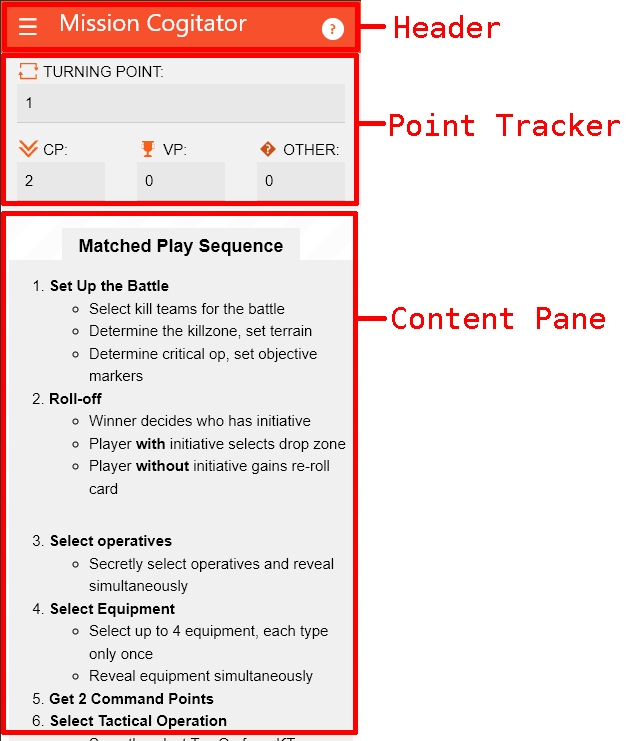
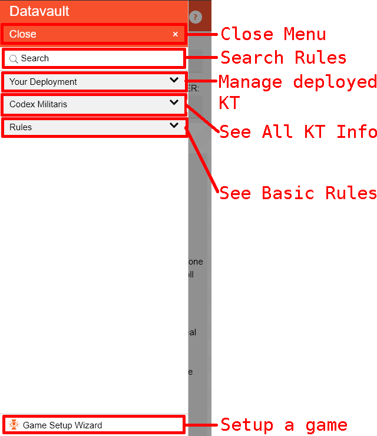
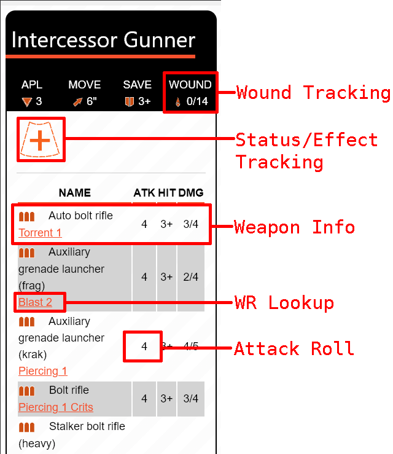

# Mission Cogitator
A WH 40K KT companion app. This web-app is entirely fan made and has **no** affiliation with any of the game's copyright holders. The app is purely designed to be used by myself, and my gaming group to allow for game tracking and rule lookup. It is not designed for wider user than that. 

Content used in this app was obtained from publicly available .pdfs provided officially by the game's owners. The .pdfs from which the written content was pulled can be found on the game's official website [here](https://www.warhammer-community.com/en-gb/downloads/kill-team/).

- [Mission Cogitator](#mission-cogitator)
  - [For Users](#for-users)
    - [App Layout](#app-layout)
    - [Basic Usage Flow](#basic-usage-flow)
  - [For Developers](#for-developers)
    - [Building Procedure](#building-procedure)
    - [Packages](#packages)
      - [Package Format](#package-format)
      - [Example: Creating a Package / Adding a KT](#example-creating-a-package--adding-a-kt)


## For Users
The following information is for individuals who wish to use this app for their own personal use. 

> [!NOTE]  
> The app is designed to be usable both on mobile and desktop devices. However screenshots will be shown as if on a mobile device since that is how the majority of people are expected to use this.

### App Layout
<table>
    <tr>
        <td></td>
        <td>
            <h3>Main Page</h3>
            <p>
                The main page is the core of the application, it consists of a header and game point tracker. Both of which are always visible, and a content pane whose contents will change based on where you are in the app.
            </p>
            <ul>
                <li><b>Header:</b> App header, use the ☰ icon to open the <i>datavault</i> menu or the 🛈 icon to set the content pane to the rules quick reference.</li>
                <li><b>Point Tracker:</b> Track your game's state. Turning Point, command points, and victory points can be tracked here. If your KT has special rules that require another kind of point tracking, the <i>other</i> tracker can be used for that purpose.</li>
                <li><b>Content Pane:</b> The contents of this area will change depending on where in the app you are. By default it loads up a rules quick reference guide.</li>
            </ul>
        </td>
    </tr>
    <tr>
        <td></td>
        <td>
            <h3>Datavault Menu</h3>
            <p>
                A slide-out side menu allowing users to navigate among the different pages in the app. Use this to access rules, equipment, KT info, and your current game's deployment. A game setup wizard is also accessible here to help new players setting up games of WH 40K KT.
            </p>
            <ul>
                <li><b>Close Menu:</b> Close the datavault menu and return focus to the content pane.</li>
                <li><b>Search Rules:</b> Open a popup dialogue to search through all rules, definitions, equipment etc recorded in the app.</li>
                <li><b>Your Deployment:</b> Manage the operatives, equipment, ploys, and faction rules for the KT you are currently playing as. This is easily configured by using the <b>Game Setup Wizard</b></li>
                <li><b>Codex Militaris:</b> A database of all KTs currently available in the app including what operatives they can field, what rules they have, and any unique equipment.</li>
                <li><b>Rules:</b> A collection of the basic rules to WH 40k KT organized in the order in which they are needed.</li>
                <li><b>Game Setup Wizard:</b> Open a popup which guides you through the process of setting up a game of WH 40k KT. At the end of the process you will be ready to play and the <b>Your Deployment:</b> section will be completely filled out.</li>
            </ul>
        </td>
    </tr>
    <tr>
        <td></td>
        <td>
            <h3>Operator Content View</h3>
            <p>
                This page is meant to look as close as possible to the unit data cards provided by the official PDFs. However this page adds some interactable elements to it adding wound and status tracking as well as quick rule lookup.
            </p>
            <ul>
                <li><b>Wound Tracking:</b> Click on the wounds to add or remove wounds. Operative's injury status will be auto determined based on how many wounds they have.</li>
                <li><b>Status/Effect Tracking:</b> Track the current status of your unit. Is your unit injured, poisoned, stuck with a markerlight? Now you can track those effects. Click the Add button to add an effect, click an effect to learn what it does, and Click+Hold or Right Click an effect to remove it.</li>
                <li><b>Weapon Info:</b> A table of weapons the operative can use with their attack die, hit, and damage numbers.</li>
                <li><b>WR Lookup:</b> A list of WR for the given weapon, click the rule to see what it does.</li>
                <li><b>Attack Roll:</b> Click a weapon's attack number to bring up a virtual dice roller to make your attack roll.</li>
            </ul>
        </td>
    </tr>
</table>

### Basic Usage Flow
The basic flow is as follows:
1. Open the app, wait for loading to be done (this may take a minute)
2. Open the datavault menu (sidebar)
   1. Click the **Game Setup Wizard** at the bottom of the menu
      1. Chose your KT, Operatives, and Equipment
      2. Follow all instructions to setup your board
   2. Navigate to the **Your Deployment** section of the menu
      1. Track operative wounds, status etc
      2. Lookup WR, faction rules, or actions
3. Enjoy your game without having to flip through multiple printed books or pdfs. 

## For Developers
The following information is for individuals who wish to contribute to this app and the app's contents. 

### Building Procedure
1. Install [dotnet SDK](https://dotnet.microsoft.com/en-us/download) 10+
2. Clone the repo
3. Run `dotnet build` to compile or `dotnet watch run` to open the app in a browser and be able to live-edit the app.

### Packages
Much of the content in this app are served as packages. Packages serve as bundles of content which are added to the app when loaded. 

Packages can contain:
- Definition = A description of a particular term often used to clarify a game rule
- Actions = An action that an operative can take during the course of gameplay
- Effect = Some condition that can be applied to a particular operative that will negatively or positively effect how they perform
- Equipment = Items the player can deploy that effect the battlefield or allow their operatives to take additional actions
- Ploys = Actions the player can take to effect what options they have during a turning point
- Units = Abstract descriptions of potential operatives and their capabilities
- Teams = Abstract representation of a given "Kill Team" (KT) box. Often they contain specific unique actions, rules, effects, ploys, and units.

#### Package Format
The package format is as follows:

A single file at the package root called `index.json`. This file describes the contents of the package by listing all the files that need to be loaded from the package. The file paths are relative to the package root. Files not listed in this index will be ignored. 

For instance a simple `index.json` may look something like this
```json
{
    "equipment": [
        "/my-equipment.html"
    ]
}
```

Besides the `index.json` file, the rest of the package consists of `*.html` files with optional [JSON](https://www.json.org/json-en.html) front-matter. Front-matter is enclosed within `---` blocks at the very start of the file and what follows is pure-html which is rendered within the app as the description of particular action/equipment/rule etc.  

```html
---
{
    "name": "My Equipment"
}
---
This is a custom homebrew piece of equipment that does the thing.
```

The html description supports one non-standard HTML tag which can be used to make linkages to game rules/actions/effects/equipment etc. This is the SEE tag. 

```html
<see cref='other-rule-id'>Some Text</see>
```

The cref attribute contains the unique ID of the other item to link to, and the text witihn the tag is arbitrary. This is rendered like a hyperlink within the app. 

#### Example: Creating a Package / Adding a KT
See `wwwroot/assets/packages/teams/pathfinders` for an example of how to begin to setup a team definition package.

Start your package by making a new folder with the name of your package; for instance, `my-kt`. In this folder create your `index.json` file. For now this file will be basically blank with the exception of a package name and some text indicating when it was updated. We will add capabilities to the file as we add resources to the package. If you want, you can stub out all capability fields with [] for now as demonstrated below, or you can just not include them. Either works.

> **FILE**: index.json
```json
{
    "name": "My Custom Package",
    "updated": "01/02/2023",
    "definitions": [],
    "actions": [],
    "effects": [],
    "equipment": [],
    "ploys": [],
    "units": [],
    "teams": []
}
```

Now we add resources. Start with simple ones like equipment or ploys. These are simple because they require very little front-matter and are mainly just descriptive text. For instance, say we have a equipment called `Fire Storm` well we'll create a new subfolder called `equipment` just to keep things organized and then a new file called `fire-storm.html` in that folder. The file name will become the unqiue id for that equipment. In this case the id will be `fire-storm`. Use this id if you want to link other descriptions to this one through use of the custom SEE tag.

> **FILE**: equipment/fire-storm.html
```html
---
{
    "name": "Fire Storm"
}
---
Summon the powers of Chaos to generate a whirlpool of fire within 3" of the operative. Can only be used once per game...
```

Be sure to add the file to the `index.json` or it won't be loaded when loading the package.
> **FILE**: index.json
```json
{
    "name": "My Custom Package",
    "updated": "01/02/2026",
    "equipment": [
        "/equipment/fire-storm.html"
    ]
}
```

Repeat this process for all resources in the package that you desire. Just be sure to put the correct resource into the correct spots within the index. Failing to do so may result in some things not showing up in the app as desired. The different categories within the `index.json` file include: "definitions", "actions", "effects", "equipment", "ploys", "units", and "teams".

Units and Teams contain significantly more front-matter than the other resource types. A Unit will define things like tags, attributes (apl, move, save, wounds), weapons, and special rules. A team will define what faction they are apart of, what special equipment they can use, what ploys they can deploy, and what units they can deploy as operatives. It is best to just look at the built in packages provided in this repo such as [Units](wwwroot/assets/packages/teams/pathfinders/units/) or [Teams](wwwroot/assets/packages/teams/pathfinders/teams/), for the Pathfinders team, for concrete examples of all the required fields. 

When done the package should either be committed to this repo as a *standard* package and then added to the `Program.cs` file to be auto-loaded like so `await packages.AddFromUrl("assets/packages/<package-path>");` **OR** should be compressed into a zip file to be destributed by yourself and can be loaded by users using functionality provided within the app.